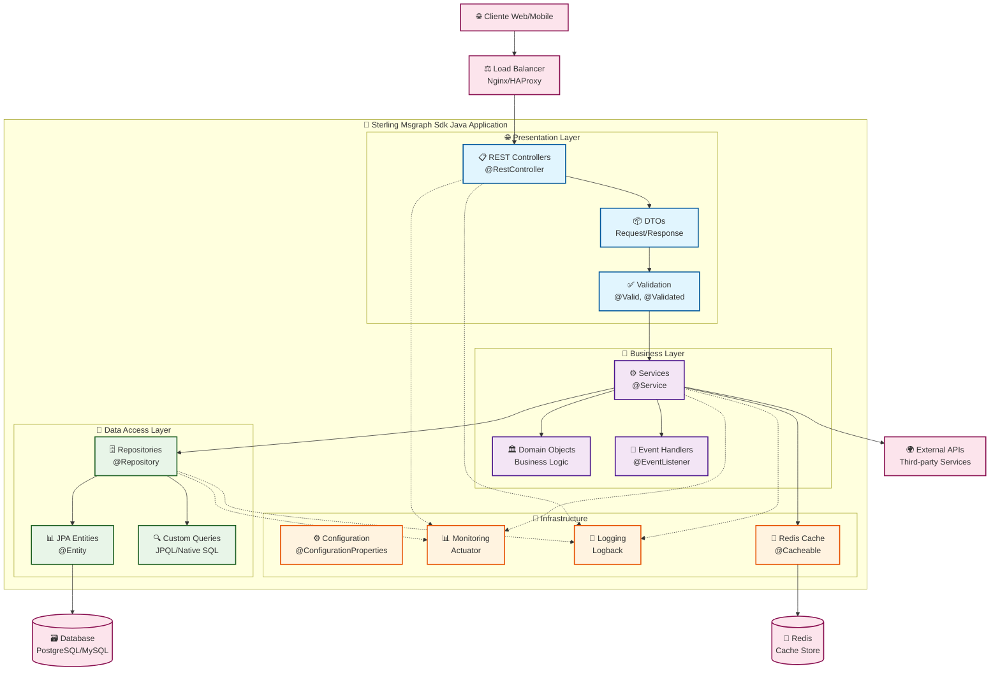

ℹ️  Generando arquitectura avanzada para: Sterling Msgraph Sdk Java (Java/Maven)
# Arquitectura - Sterling Msgraph Sdk Java

## 🏗️ Visión General

Sterling Msgraph Sdk Java es una aplicación backend desarrollada en Java/Spring Boot que sigue una arquitectura de capas bien definida, implementando patrones de diseño empresariales y mejores prácticas de desarrollo.

## 📊 Diagrama de Arquitectura Detallado

## 🔧 Componentes Principales

### 🌐 Presentation Layer (API Layer)
- **REST Controllers**: Endpoints HTTP para operaciones CRUD
- **Request/Response DTOs**: Objetos de transferencia de datos
- **Validation**: Validación de entrada con Bean Validation
- **Exception Handlers**: Manejo centralizado de errores
- **Security**: Autenticación y autorización con Spring Security

### 🧠 Business Layer (Service Layer)
- **Services**: Lógica de negocio y reglas empresariales
- **Business Objects**: Entidades de dominio
- **Transactions**: Gestión de transacciones con @Transactional
- **Event Handling**: Manejo de eventos del dominio
- **Validation**: Validaciones de negocio complejas

### 💾 Data Access Layer (Repository Layer)
- **JPA Repositories**: Acceso a datos con Spring Data JPA
- **Entity Mapping**: Mapeo objeto-relacional con Hibernate
- **Query Methods**: Consultas personalizadas con JPQL/SQL nativo
- **Database Migrations**: Control de versiones de BD con Flyway/Liquibase
- **Connection Pooling**: Pool de conexiones optimizado

### 🔧 Infrastructure Layer
- **Configuration**: Configuración externa con Spring Boot
- **Monitoring**: Métricas con Actuator y Micrometer
- **Logging**: Logging estructurado con Logback
- **Caching**: Cache distribuido con Redis
- **Messaging**: Comunicación asíncrona opcional

## 🔄 Flujo de Datos

### 📥 Request Flow (Entrada)
1. **Cliente** envía petición HTTP
2. **Load Balancer** distribuye la carga
3. **Controller** recibe y valida la petición
4. **DTO** mapea datos de entrada
5. **Service** ejecuta lógica de negocio
6. **Repository** accede a datos
7. **Database** persiste/recupera información

### 📤 Response Flow (Salida)
1. **Repository** retorna datos
2. **Service** procesa y transforma
3. **DTO** mapea datos de salida
4. **Controller** formatea respuesta HTTP
5. **Cliente** recibe respuesta JSON

## 🛡️ Patrones de Diseño Implementados

### 🏛️ Architectural Patterns
- **Layered Architecture**: Separación clara de responsabilidades
- **Dependency Injection**: Inversión de control con Spring IoC
- **Repository Pattern**: Abstracción del acceso a datos
- **Service Layer Pattern**: Encapsulación de lógica de negocio

### 🔧 Design Patterns
- **DTO Pattern**: Transferencia eficiente de datos
- **Builder Pattern**: Construcción de objetos complejos
- **Strategy Pattern**: Algoritmos intercambiables
- **Observer Pattern**: Manejo de eventos
- **Cache-Aside Pattern**: Gestión de cache

## 🚀 Características Técnicas

### ⚡ Performance
- **Connection Pooling**: HikariCP para conexiones DB
- **Lazy Loading**: Carga perezosa de entidades JPA
- **Distributed Caching**: Redis para cache de aplicación
- **Async Processing**: Operaciones asíncronas con @Async

### 🛡️ Security
- **Authentication**: JWT/OAuth2 con Spring Security
- **Authorization**: Control de acceso basado en roles
- **Input Validation**: Validación robusta de entrada
- **SQL Injection Prevention**: Prepared statements automáticos

### 📊 Monitoring & Observability
- **Health Checks**: Endpoints de salud con Actuator
- **Metrics**: Métricas de aplicación con Micrometer
- **Distributed Tracing**: Trazabilidad con Sleuth/Zipkin
- **Structured Logging**: Logs estructurados en JSON

## 🔧 Tecnologías Utilizadas

### 🏗️ Core Framework
- **Spring Boot**: Framework principal de aplicación
- **Spring MVC**: Framework web para REST APIs
- **Spring Data JPA**: Abstracción de acceso a datos
- **Spring Security**: Framework de seguridad

### 💾 Data & Persistence
- **Hibernate**: ORM para mapeo objeto-relacional
- **PostgreSQL/MySQL**: Base de datos relacional principal
- **Flyway/Liquibase**: Migraciones de base de datos
- **Redis**: Cache distribuido y sesiones

### 🔧 Infrastructure
- **Maven/Gradle**: Gestión de dependencias y build
- **Docker**: Contenedorización de aplicación
- **Actuator**: Monitoreo y métricas
- **Logback**: Framework de logging

## 📈 Escalabilidad

### 🔄 Horizontal Scaling
- **Stateless Design**: Aplicación sin estado para escalado
- **Load Balancing**: Distribución de carga entre instancias
- **Database Sharding**: Particionamiento de datos
- **Cache Distribution**: Cache distribuido entre nodos

### ⚡ Performance Optimization
- **Database Indexing**: Índices optimizados para consultas
- **Query Optimization**: Consultas JPA optimizadas
- **Connection Pooling**: Pool de conexiones configurado
- **Cache Strategies**: Estrategias de cache eficientes
