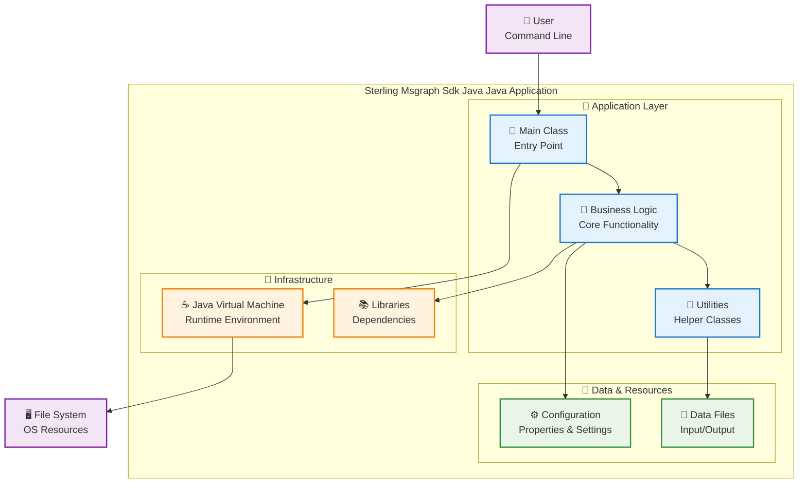

# Arquitectura - Sterling Msgraph Sdk Java

## 🏗️ Visión General

Sterling Msgraph Sdk Java es una aplicación Java simple con 5 archivos, implementando una arquitectura básica pero sólida.

### 📊 Análisis del Código
- **Archivos Java**: 5 archivos
- **Framework**: Java puro (sin Spring Boot)
- **Tipo**: Aplicación Java standalone

## 📊 Diagrama de Arquitectura

## 🔧 Características de la Aplicación Java

### ⚡ Simplicidad y Performance
- **Java puro**: Sin overhead de frameworks pesados
- **Ejecución directa**: JVM nativo para máximo rendimiento
- **Memoria eficiente**: Uso optimizado de recursos

### 🛡️ Robustez
- **Manejo de excepciones**: Try-catch para control de errores
- **Logging**: System.out o java.util.logging
- **Configuración**: Properties files o argumentos de línea de comandos

## 🚀 Casos de Uso Típicos
- Herramientas de línea de comandos
- Procesamiento de archivos
- Utilidades de desarrollo
- Scripts de automatización
- Aplicaciones batch

Esta arquitectura es ideal para aplicaciones Java simples y eficientes.
