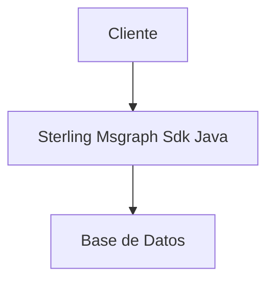

# Arquitectura - Sterling Msgraph Sdk Java

## 🏗️ Visión General

Servicio backend desarrollado en Java/Maven basado en Java/Maven.

## 🔧 Componentes Principales

### API Layer
- Endpoints REST/GraphQL
- Middleware de autenticación
- Validación de datos

### Business Logic
- Servicios de negocio
- Procesamiento de datos
- Reglas de validación

### Data Layer
- Base de datos
- Modelos de datos
- Repositorios

## 📊 Diagrama de Arquitectura

## 🚀 Tecnologías

- **Stack Principal**: Java/Maven
- **Puerto**: 8080
- **Tipo**: Backend
